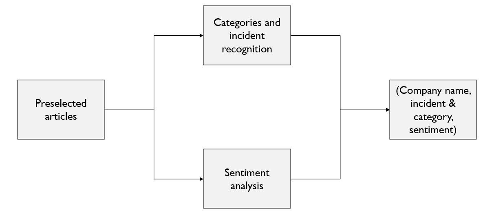
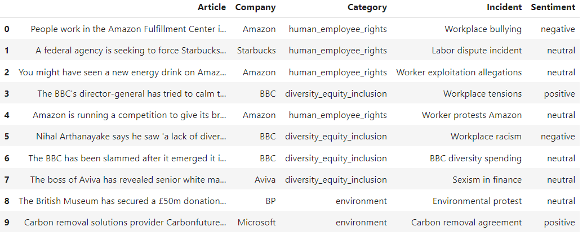

# Recognizing incidents and their sentiment in short texts
Agata Kaczmarek

## Structure of the repository
* `data` - directory with most of the data needed to run `final_pipeline.ipynb`. The only file too big to store on GitHub is the original Actaware Inc data, which should be downloaded from [here](https://drive.google.com/file/d/1WNaTt7WLZjqp6-JyS9kj7XVsVG6v59N9/view?usp=sharing) and moved to `data` folder.
* `img` - directory with all images needed for `README.md`.
* `notebooks_with_experiments` - directory containg notebooks for the experiments conducted during the work on the thesis.
* `old_work` - resources from previous steps of work on the thesis.
* `results_of_experiments` - directory with all results from conducted experiments.
* `src` - directory with source files to run `Final_pipeline.ipynb` file.
* `actaware_data_preprocessing.ipynb` - notebook with proposed preprocessing of original data from Actaware Inc. The proprocessing does not include labelling of chosen subsets of the data.
* `Final_pipeline.ipynb` - notebook with final pipeline, proposed as the solution for the problem.
* `requirements.txt` - what libraries needs to be installed to run final pipeline. For running experiments, additional requirements are mentioned in the appropriate directory.

## Pipeline of the solution



The pipeline consists of two parts: categories and incident recognition and sentiment analysis. For both parts various approaches were tested, but for the final solution, incidents and categories are recognized using GPT-4o-mini model, whereas sentiment is found using ensemble of two models: RoBERTa and graph-based solution. The output of the solution includes article, company name, incident, category and sentiment, as can be seen below.


## How to run:

To run the solution, installed conda is recommended.

```
conda create -n env_actaware python=3.10.12
conda activate env_actaware
pip install -r requirements.txt
python -m spacy download en_core_web_sm
```
and run notebook `Final_pipeline.ipynb`.

For running notebooks with experiments, please find more details described in `notebooks_with_experiments`.