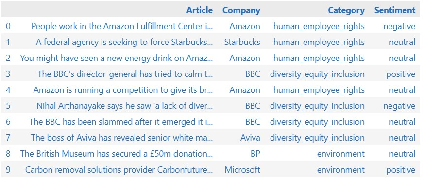

# Recognizing Selected Features in the News Text

This repository includes materials created during work on the paper `Recognizing Selected Features in the News Text`. It includes demonstrating scenario of the created pipeline, prepared data and codes used to run all experiments related to the work.

## Real-world scenario considered in this work

[Actaware Inc.](https://actaware.com) is developing an application allowing users to scan products and learn about their producers and the values they represent. During registration for the app, users select values that are important to them, e.g. environment, animal care, or human and employee rights, as can be seen on the screenshot below. Next, when scanning the products, users receive producer scores, based on this “value compass”. In the application, producers’ actions are evaluated based on news articles. 


This work aimed to create a solution that can match the content of the news to predefined categories (from the “value compass”): human and employee rights, diversity, equity and inclusion, environment, animal care, corporate transparency, business involvement, political and religious views, and other. Next, the developed solution should establish the sentiment of the considered articles.

Here, to address article categorization, state-of-the-art methods, i.e. KeyBERT, GPT-3.5-turbo, and GPT-4o-mini, have been tested during experiments. Similarly, for sentiment analysis, BERT- and GPT models, along with a novel graph-based solution, have been tried. 

In this context, the contributions of the work are as follows: 
(a) evaluating the dataset provided by Actaware and enhancing part of it with annotations of categories and sentiment (see directory `data`),
(b) introducing evaluation methods, including performance metrics and addressing sustainability, resources, cost and explainability, 
(c) experimental evaluation of the performance of possible approaches to text news categorization and establishing their sentiment, 
(d) proposing a comprehensive solution using state-of-the-art (as of Fall 2024) tools.

### Solution


The final pipeline consists of two parts: categories recognition and sentiment analysis. For both parts various approaches were tested, but for the final solution, categories are recognized using GPT-4o-mini model, whereas sentiment is found using ensemble of two models: RoBERTa and graph-based solution. The output of the solution includes article, company name, category and sentiment, as can be seen below.


## Requirements

To run the solution, installed conda is recommended.

```
conda create -n env_actaware python=3.10.12
conda activate env_actaware
pip install -r requirements.txt
python -m spacy download en_core_web_sm
```
and run notebook `Final_pipeline.ipynb`. Please be aware, that you need to provide your own OpenAI API key in `src\config.py` file to run the solution.

For running notebooks with experiments, please find more details described in `notebooks_with_experiments`.

For reproducing our work, please relate to `other_experiments` directory. Please be aware that in might be necessary in some cases to update the paths to some of the dependencies, in case you want to run any of the experiments.

## Example usage

To run the final version of the presented work, please look on `Final_pipeline.ipynb` notebook. 

## Structure of the repository

* `data` - directory with most of the data needed to run `final_pipeline.ipynb`. The only file too big to store on GitHub is the original Actaware Inc data, which should be downloaded from [here](https://drive.google.com/file/d/1WNaTt7WLZjqp6-JyS9kj7XVsVG6v59N9/view?usp=sharing) and moved to `data` folder.
* `img` - directory with all images needed for `README.md`.
* `notebooks_with_experiments` - directory containg notebooks for the experiments conducted during this work.
* `other_experiments` - resources related to our other approaches, including incident recognition part.
* `results_of_experiments` - directory with the results from conducted experiments.
* `src` - directory with source files to run `Final_pipeline.ipynb` file.
* `actaware_data_preprocessing.ipynb` - notebook with proposed preprocessing of original data from Actaware Inc. The proprocessing does not include labelling of chosen subsets of the data.
* `Final_pipeline.ipynb` - notebook with final pipeline, proposed as the solution for the problem.
* `requirements.txt` - what libraries needs to be installed to run final pipeline. For running experiments, additional requirements are mentioned in the appropriate directory.

## Authors

Title: Recognizing Selected Features in the News Text

Authors: 
- Agata Kaczmarek (agata.kaczmarek@pw.edu.pl), Faculty of Mathematics and Information Science, Warsaw University of Technology, Warsaw, Poland
- Filip Tobolewski, Actaware Inc., Concord, California, US
- Maria Ganzha (maria.ganzha@pw.edu.pl), Faculty of Mathematics and Information Science, Warsaw University of Technology, Warsaw, Poland
- Marcin Paprzycki (marcin.paprzycki@ibspan.waw.pl), Systems Research Institute Polish Academy of Sciences, Warsaw, Poland
- Anna Wróblewska (anna.wroblewska1@pw.edu.pl), Faculty of Mathematics and Information Science, Warsaw University of Technology, Warsaw, Poland