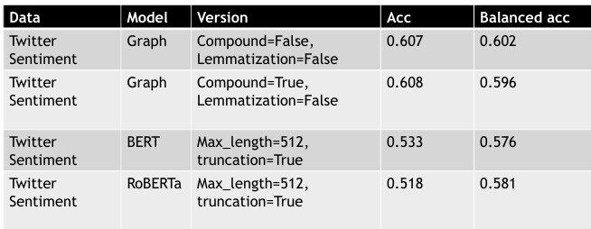

# Recognizing incidents and their sentiment in short texts
Agata Kaczmarek

## Structure of the repository
* `notebooks` - directory containg notebooks and files that are more tidy than `work_in_progress` :)

## Current plan and setup

To recognize incidents the topic modeling model BERTopic is used. Performance is measured by metrics: TopicDiversity, mean diversity in topics and Coherence. 

* Coherence metrics - measure how the top-k words in the topic relate to each other
* Significance metrics - aim at discovering high-quality and junk topics based on document-topic and topic-word distributions
* Diversity metrics - measure diversity of words in topics

For sentiment analysis three models are being compared: BERT, RoBERTa and graph based solution. The metric to compare them is balanced accuracy, measured on dataset similar to ACTAWARE (https://www.kaggle.com/datasets/hoshi7/news-sentiment-dataset).

### Future work

1. Add significance and probably similarity metrics for topic modeling.
2. Define what means "best results" for this part - any suggestions, which metrics are more important and makes more sense?
3. Check other models and compare to BERTopic.
4. Find best setup (including hyperparameters) for topic modeling.
5. Solve issues with BERT and RoBERTa regarding input tokens.
6. Find best configuration (including hyperparameters) for sentiment analysis.

## Current results for topic modeling 

Diversity parameter: 0.5, coherence metric: c_npmi, TopicDiversity: 0.7886792452830189, mean diversity in topics: 1.0, coherence score: 0.034461948245713726, KL background: 2.534053223796575, KL vacuous: 2.4354541148173947.

Diversity parameter: 0.2, coherence metric: c_npmi, TopicDiversity: 0.7061320754716981, mean diversity in topics: 0.9001286449399674, coherence score: 0.09791122425972787, KL background: 2.534053223796575, KL vacuous: 2.3216755782442813.

Diversity parameter: 0.05, coherence metric: c_npmi, TopicDiversity: 0.680188679245283, mean diversity in topics: 0.8406534503232632, coherence score: 0.11335504226096892, KL background: 2.534053223796575, KL vacuous: 2.3040921834697.

Sample topic:

[('hamas', 0.03437410007487483),
 ('terrorist', 0.01593485845474893),
 ('antisemitism', 0.01382230042677843),
 ('jews', 0.012036425841046161),
 ('civilians', 0.007678645589811692),
 ('staff', 0.007132417021782438),
 ('attacks', 0.0069416562088209215),
 ('bbcs', 0.005977607178207836),
 ('editorial', 0.005890806183172142),
 ('simpson', 0.005484746849865494)]

For given text (part of it is shown below):

The BBC is being urged to drop singer Olly Alexander as its entrant for Eurovision after it emerged he signed a letter calling Israel an 'apartheid regime'. The Years And Years frontman, 33, was unveiled as next year's candidate for the UK during the Strictly Come Dancing final, which aired on the BBC on Saturday. But he now faces having that role stripped from him after he signed a letter from LGBT charity Voices4London which described Israel as an 'apartheid regime' which is trying to 'ethnically cleanse' Palestine. The statement, which was published on October 20, almost two weeks after Hamas' October 7 attack, also says that Israel has 'terrorised' Palestinian people and there is now a 'genocide' taking place 'in real time'.[...]

## Current results for sentiment analysis

